# Minitwit on a docker swarm cluster using terraform

In this scenario we will create a scalable docker swarm cluster using terraform.

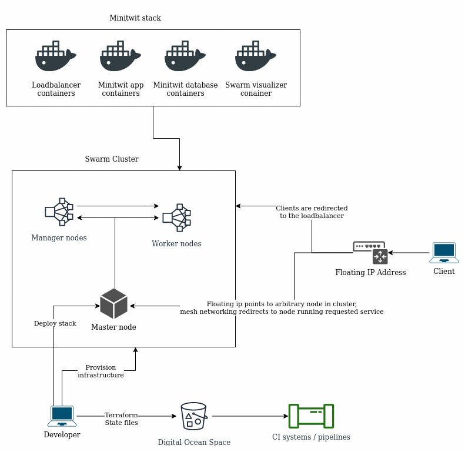

## Setup

### Install terraform

On Ubuntu
```bash
wget https://releases.hashicorp.com/terraform/0.12.24/terraform_0.12.24_linux_amd64.zip
unzip terraform_0.12.24_linux_amd64.zip
rm terraform_0.12.24_linux_amd64.zip
mv terraform /usr/bin/terraform
```
For other platforms: https://www.terraform.io/downloads.html

### Clone this repository

TODO

```bash
git clone ...
```

### Generate ssh key

Make sure to call this command from the root of the repository you just cloned.

```bash
mkdir ssh_key && ssh-keygen -t rsa -b 4096 -q -N '' -f ./ssh_key/terraform
```

### Setup secrets environment variables file

By default the script will look for a file called `secrets` in root of the repository, that contains the variables needed to interact with Digital Ocean.

Copy the template file:

```bash
cp secrets_template secrets
```

We need to fille in the blanks for the five environment variables:


```bash
export TF_VAR_do_token=
export SPACE_NAME=
export STATE_FILE=
export AWS_ACCESS_KEY_ID=
export AWS_SECRET_ACCESS_KEY=
```

The following steps outline how to get each variable:

#### Digital Ocean token

To be abel to provision digital ocean resources using terraform we need an API token. Log in to the cloud portal: https://cloud.digitalocean.com
Then navigate to the API page in left menu on the left: (https://cloud.digitalocean.com/account/api/).

From here click on `Generate New Token`. Enter a name for the token, like 'terraform'. After confirming the token will show in the list and can be copied. Note that this is the only time the token will be visible, and you'll have to regenerate the token if you need to see it again.

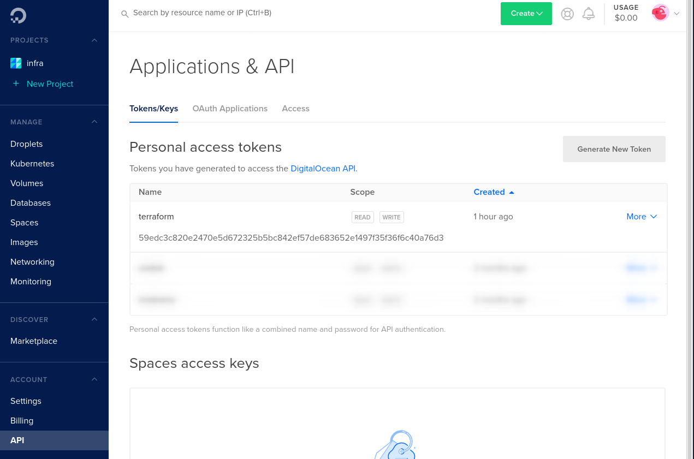

The token string will be the value for the `TF_VAR_do_token` environment variable.

#### Digital Ocean Space

Digital Ocean's blob storage is called `Spaces`, they are essentially AWS s3 buckets but on Digital Ocean, and use an identical API, so tools designed for using s3 buckets will work with Spaces. We will use a 'Space' to store out terraform state file, more on that in a minute.

To create a new space click on the spaces tab in menu on the left (https://cloud.digitalocean.com/spaces), then click on the green dropdown `Create` and select 'Spaces.'

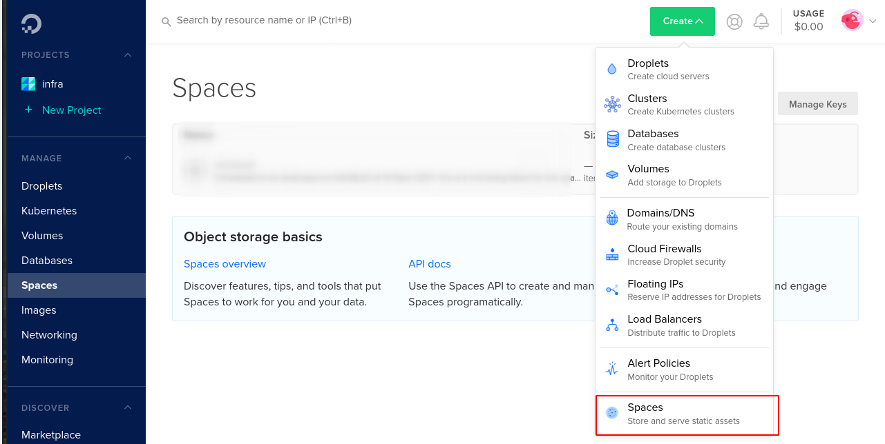

Choose the Franfurt datacenter region and enter a name for the space.

(You can choose another region if you want, just edit the terraform backend file `backend.tf` to chosen region)

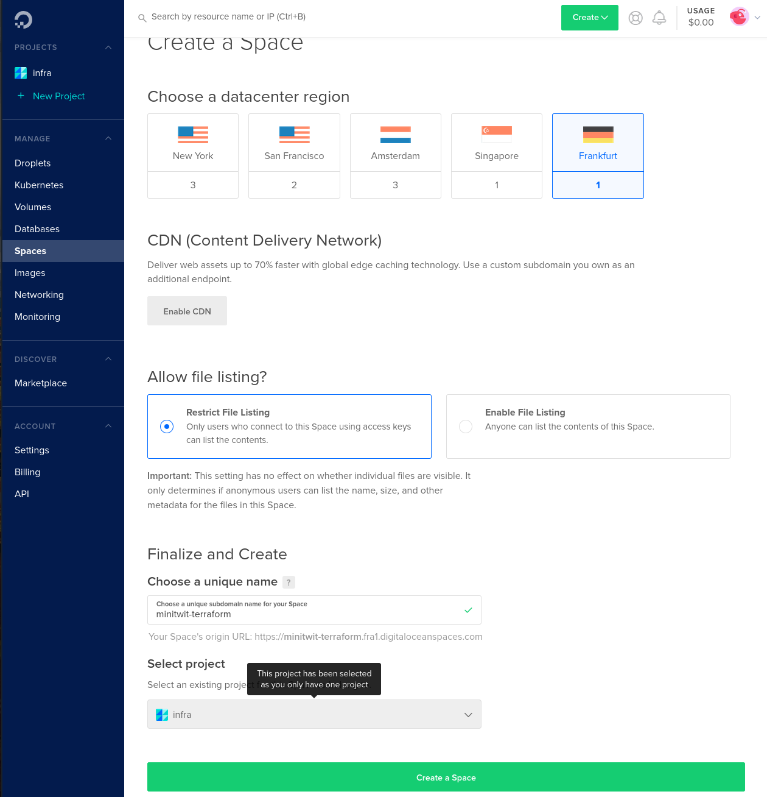

Click 'Create Space'.

The name we entereted for the space will be the value for the `SPACE_NAME` value in the `secrets` file.

#### Spaces access keys

Next we need to generate a key pair to access our space. Go to the API page where we generated the API token. Click `Generate New Key`, and enter a name, like 'minitwit'. The key conists of two strings the key itself and the secret key. The keys will be displayed right after creation, and then never again, like with the API token, so make sure to save them. We put the key and secret key into the `secrets` file: the key is the value for `AWS_ACCESS_KEY_ID` and the secret key is the value for `AWS_SECRET_ACCESS_KEY`. The reason that the environment variable are called 'AWS...' is that the tools that utilitize them were made for interacting with AWS s3 buckets, but we can use them for Digital Ocean spaces as they share the same API, though the naming can get a little confusing.

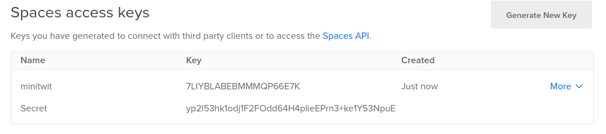

#### Terraform state file

The final environment variable in the `secrets` file is the name of the terraform state file, by convention we call it `<project>/terraform.tfstate`, so we will use `minitwit/terraform.tfstate`, though you can call it what you want as long as it has a .tfstate filetype.

##### Finished secrets file

After the previous steps the `secrets` file looks like this:

```bash
export TF_VAR_do_token=59edc3c820e2470e5d672325b5bc842ef57de683652e1497f35f36f6c40a76d3
export SPACE_NAME=minitwit-terraform
export STATE_FILE=minitwit/terraform.tfstate
export AWS_ACCESS_KEY_ID=7LIYBLABEBMMMQP66E7K
export AWS_SECRET_ACCESS_KEY=yp2l53hk1odj1F2FOdd64H4plieEPrn3+ke1Y53NpuE
```

(these are just example values and were destroyed after writing this guide.)

We now have all we need to bootsrap the docker swarm cluster and run minitwit on it.


# Bootstrap the swarm cluster

Run the bootstrap script:

```bash
bash bootstrap.sh
```

The script will do the following:
* load environment variables from the `secrets` file
* verify that all environment variables are set
* initialize terraform with spaces bucket backend
* validate the terraform configuration
* create the infrastructure
    * create a master docker swarm node that initializes the swarm cluster
    * a number of manager nodes that join the swarm cluster
    * a number of worker nodes that join the swarm cluster
* run a script that will generate a confugration file for using nginx as a loadbalancer in swarm cluster
* upload the configuration file to each node in the cluster
    * this is required because we bindmount the configuration file into the loadbalancer container, and since we do not know what node it will run on, we have to have the file available on all nodes.
* deploy the minitwit stack to the cluster
* finally print the public ip-address attached to the cluster

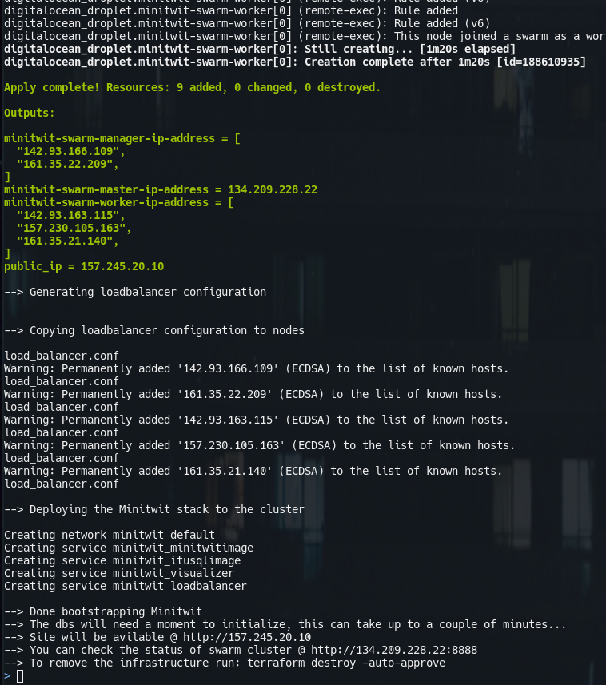

We can inspect the running cluster and stack with the visualizer container:

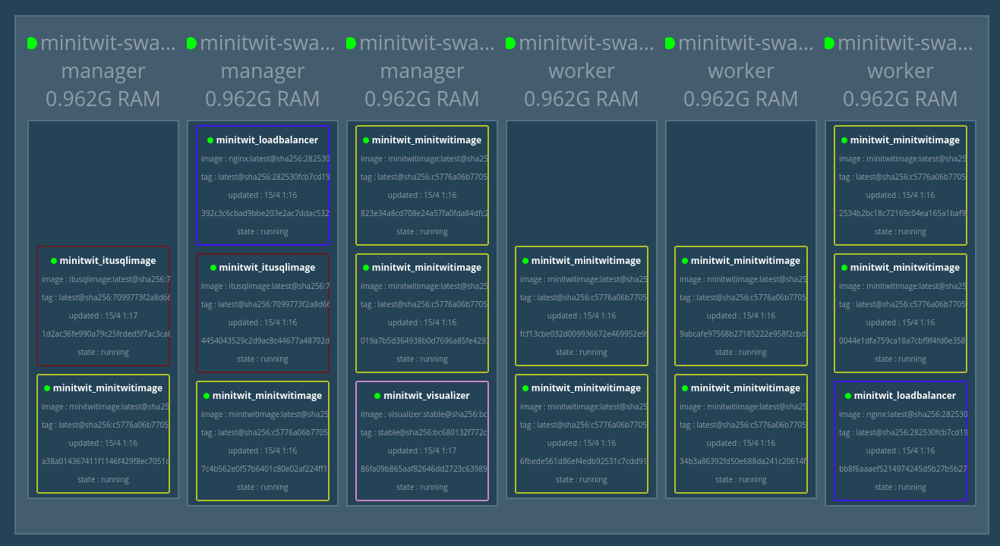


# Cool, so how do I scale?

## Interacting with the Minitwit stack

To interact with the swarm cluster and the minitwit stack we need to have shell on node in the cluster, so we SSH to the master node:
```bash
ssh root@$(terraform output minitwit-swarm-master-ip-address) -i ssh_key/terraform
```
### A few interesting commands:

List all nodes
```bash
docker node ls
```
List containers on each node
```bash
for node in $(docker node ls -q); do docker node ps $node; done
```
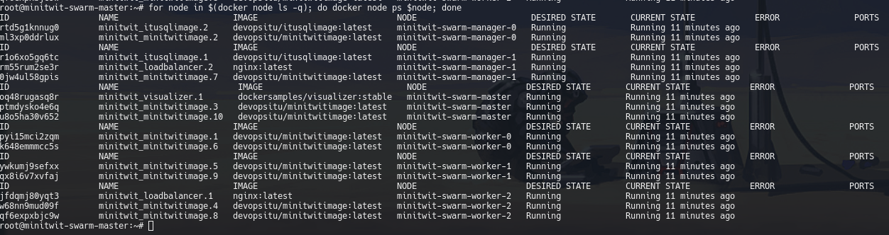

List all services
```bash
docker service ls
```

List containers in a service
```bash
docker service ps <service-name>
```

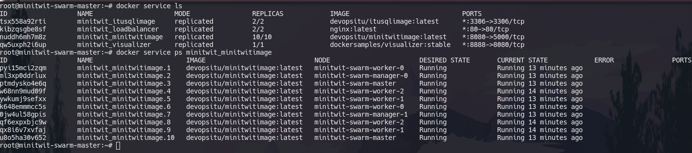

You can also simply list all containers of a stack
```bash
docker stack ps <stack-name>
```

If we want to scale one of the services, we change the number of replicas in the stack file, in this case `minitwit_stack.yml` and then deploy it again. Docker will then modify the existing cluster state to match the new desired state, creating and removing services, and scaling existing ones.
```bash
docker stack deploy <stack-name> -c <stack-file>
```

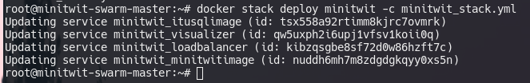

We can manually scale a service
```bash
docker service scale <service-name>=<replicas>
```

We can perform a rolling update of service
```bash
docker service update --image <image-name>:<tag> <service-name>
```

We can rollback the last update of a service
```bash
docker service rollback <service-name>
```


## Interacting with the swarm cluster

To interact with swarm cluster you can edit the `minitwit_swarm_cluster.tf` file, to scale the cluster change the `count` variable to the desired number of nodes (vms) and then run `$ terraform apply` to modify the existing infrastructure.

### Using Terraform

All the following commands are contextual to the directory that contains the terraform files.

Initialize terraform for the current project
```bash
terraform init
```

Verify that the terraform files follow correct syntax
```bash
terraform validate
```

Preview the changes to made at next apply
```bash
terraform plan
```

Apply changes --> actually create the cloud environment
```bash
terraform apply
```

Destroy all of the infrastructure
```bash
terraform destroy
```

List all outputs
```bash
terraform output
```


## Docker Stack

`docker stack` is `docker-compose` but for swarm clusters. docker stacks let's us declaratively configure our services that we want to run in our cluster. A docker stack file is the same as a docker-compose but has a few more keys available, namely `deploy`, that let's us specify the number of replicas for `replicated services` or specify a service as a `global` service (1 container on each node).

The minitwit stack:

```yaml
version: '3.3'

volumes:
  mysql_data:

services:

  visualizer:
    image: dockersamples/visualizer:stable
    ports:
      - "8888:8080"
    volumes:
      - "/var/run/docker.sock:/var/run/docker.sock"
    deploy:
      placement:
        constraints: [node.role == manager]

  loadbalancer:
    image: nginx
    ports:
      - '80:80'
    volumes:
      - /loadbalancer:/etc/nginx/conf.d
    deploy:
      replicas: 2

  minitwitimage:
    image: devopsitu/minitwitimage
    ports:
      - '8080:5000'
    deploy:
      replicas: 10

  itusqlimage:
    image: devopsitu/itusqlimage
    ports:
      - '3306:3306'
    environment:
      - MYSQL_ROOT_PASSWORD=megetsikkertkodeord
    volumes:
      - mysql_data:/var/lib/mysql
    deploy:
      replicas: 2
```


### Cluster databases and docker networks

The above configuration specifies two database container replicas, this is done to illustrate the power of docker networking, the minitwit app images look for the database simply using the service name as hostname, as service names can be used for DNS lookup in docker networks. This means that a request to a database will hit one of the two database containers, though not guaranteed to hit a specific one. In this case this will create inconsistency in application state. For a production system the consensus seems to be to use the cloud provider's scalabale database offerings, or simply running the databases on servers outside the cluster. But for a lot of use-cases (not neccarily databases) docker networks allow for very convenient communication between containers in the cluster.

You can inspect the networks of the docker swarm by SSH'ing to one of the nodes and using the `docker network` command.

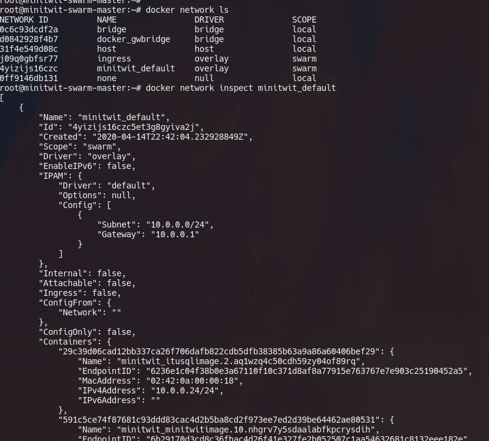


## Terraform backends

Terraform maintains a `.tfstate` file that contains the current state of your infrastructure. `backends` are the different ways that terraform can store this state file. By default terraform will use the `local` backend which is simply creating files locally, which is fine for testing. For production deployments we want to store the statefiles a safe place, so that we don't loose them, and so that the state is not tied to a single machine for teams working on the same infrastructure.

Therefore in this scenario we use Digital Ocean space to store our terraform state files, such that all terraform commands interact wit the remote state.

### Integrating with CI

Another usecase for remote terraform state is that we can make the state avilable to our CI systems. Since they are simply stored in a s3-API-compatible blob store, we can use s3 tools to interact with the files. An example of how to do this is found in the `docker/s3cmd` directory. `s3cmd` is a cli tool for interacting with s3 buckets. the docker/s3cmd contains a dockerfile for docker image that contains s3cmd ready-to-use, by simply providing the keys as environment variables. The script `docker/s3cmd/get_terraform_state.sh` shows how to use docker image to get the terraform state files. Terraform state files are plain JSON so we can use tools like `jq` to easily parse the values we need, like the ip addresses of the nodes. Also note in the example below that i `source` the secrets file to load the variables into my shell.

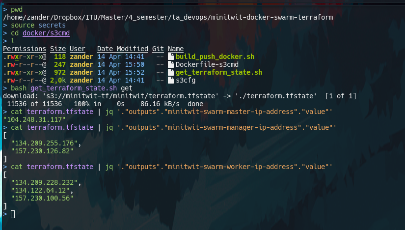
